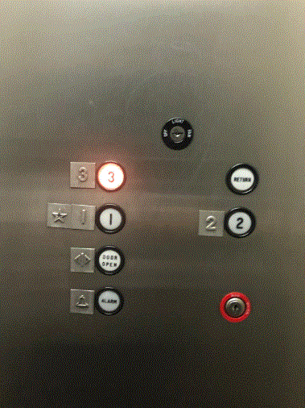
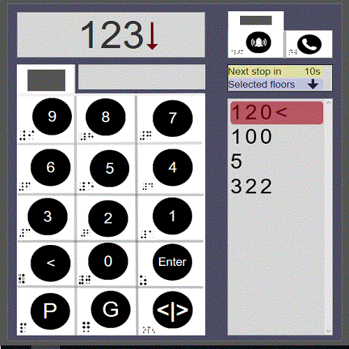

# Aneesha_git
Defective Interface:

New Design:

Website Link : https://dt8e06.axshare.com

-> primary function of an elevator implemented?
a) Open door , Close door is automatic
b) select floors
c) ground floor, parking and emergency condition handling
d) Buttons are made in circle shape as we humans have tendency to press buttons which is circular.

-> Visibility of system status?
yes.

-> Match between system and the real world?
Only Numbers and common notations like 'G' , 'P' used

-> Consistency and standards?
All buttons round, maintained consistent size.

-> Recognition rather than recall?
A simple, clean, minimal interface, despite having to provide support for a thousand floors.

-> Aesthetic and minimalist design?
Minimal

-> Elevator feedback:
   Next stop estimated time(The state of the system is displayed to the outside world), 
   Next floor highlight(Covinience and making user comfortable),
   Audio support for the visually impaired for each recognised touch on the brail on acrylic sheet.

3. What's new?
a) Support for the visually impaired by providing
a physical material(Here acrylic touch sheets with brail printed) as it is touchscreen! 
They are also supported by audio about the current state of the system and button press.
b) Only 1 button to open or close door:
Door has 2 states open and close - two states can be hadled with
single trigger as switch between the actions is the only requirement.(eg1: Close can be made automatic)
c) Support for taller buildings, It can handle around 1000 floors.

Tool Used: Axure RP

References: 
Axure RP beginner Tutorials
Analyzing elevator controls using Nielsen-Norman’s Usability Heuristics
http://www2.isye.gatech.edu/~jjb/misc/elevators/elevators.html
https://cs.stanford.edu/~merrie/papers/touchplates.pdf
Burj Khalifa Elevator Interface - Video Results
https://medium.com/@_tarunc/how-would-you-design-an-interface-for-a-1000-floor-elevator-31fbe5be6470

Note: 
All validations for the user inputs and 
audio support for visually impared to be handled at real time implementation.
Limitation: 
Adding selected floors to the listbox is not implemented as more effort required in Axure RP.
